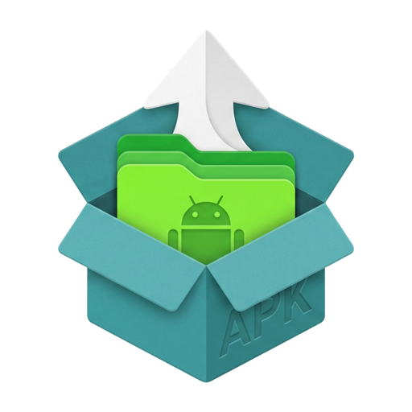
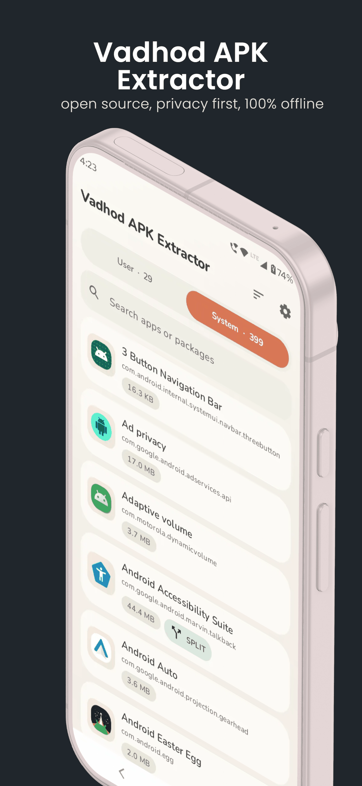
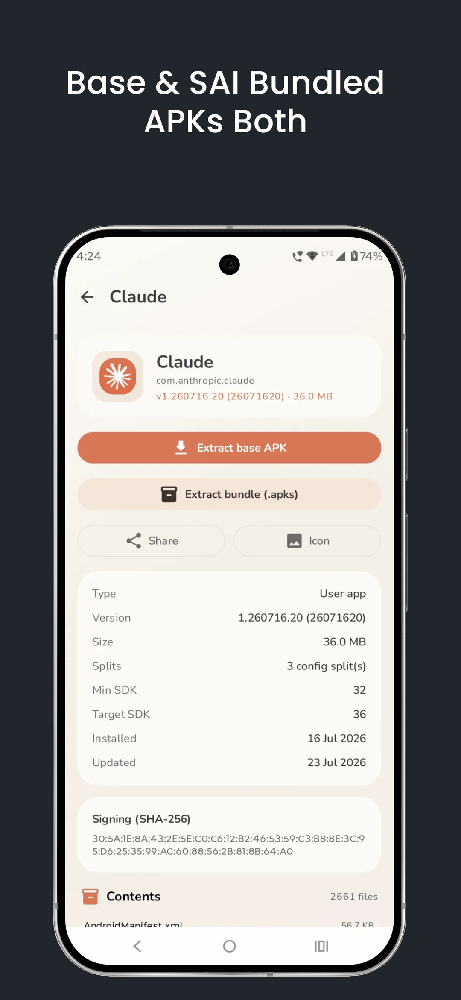
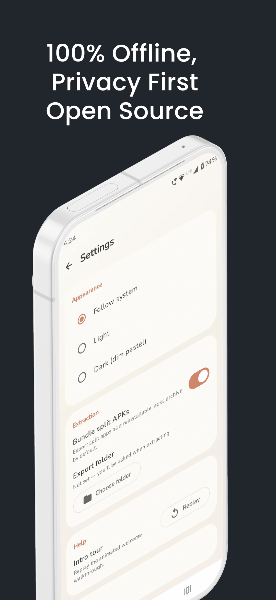
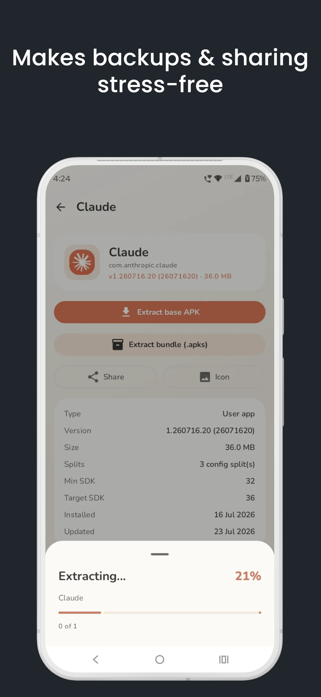
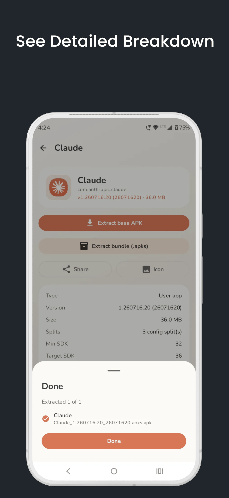

<div align="center">



# Vadhod APK Extractor

**A beautiful, privacy-first tool to extract and back up the APK of any app on your device — completely offline.**

[](LICENSE)
[](https://github.com/pgxor/com.vadhod.apkextractor/releases/latest)
[](https://github.com/pgxor/com.vadhod.apkextractor/actions/workflows/build.yml)
[-3DDC84?style=flat-square&logo=android&logoColor=white)](#requirements)
[](#privacy)
[](https://kotlinlang.org)
[](https://developer.android.com/compose)

<a href="https://play.google.com/store/apps/details?id=com.vadhod.apkextractor">
  
</a>

</div>

---

## Screenshots

<div align="center">





</div>

---

## What it does

Modern Android apps ship as **split APKs** — a base APK plus per-density, per-language and per-ABI
splits. Most extractors quietly hand you the base APK alone, and the backup won't reinstall.

Vadhod handles it properly:

- **Simple apps** export as a clean single `.apk`.
- **Split apps** are bundled into one reinstallable `.apks` archive (base + all splits).

Your backups actually reinstall.

## Features

### 🔒 Private by design

- **100% offline** — the app declares **no `INTERNET` permission at all**.
- No tracking, no analytics, no crash reporting, no ads, no accounts.
- Nothing ever leaves your device. Files are written only to the folder you pick.

### 📦 Extract & back up

- Browse every installed app, split into **System** and **User** tabs.
- Search, and sort by name, size, install date or last update.
- Extract a single app, or **select many and batch-extract** with live per-item and overall progress.
- Save anywhere using Android's **Storage Access Framework** — no broad storage permissions.

### 🧩 Split-APK aware

- Export just the base APK, or bundle base + splits into a reinstallable `.apks` archive.
- The default export format is configurable in Settings.

### 🔍 Inspect & share

- Version, size, min/target SDK, install and update dates.
- The **signing certificate (SHA-256)** and a full listing of the APK's contents.
- Share an extracted APK, or export any app's icon as a PNG.

### 🎨 Beautiful

- A soft, calm pastel design system with full **light and dark themes**.
- Honors your system font scale and reduce-motion preference. WCAG AA contrast throughout.

---

## Download

| Source | Link | Notes |
| --- | --- | --- |
| **Google Play** | [play.google.com](https://play.google.com/store/apps/details?id=com.vadhod.apkextractor) | Recommended — automatic updates |
| **GitHub Releases** | [Latest release](https://github.com/pgxor/com.vadhod.apkextractor/releases/latest) | Signed `.apk` + source archives |
| **F-Droid** | _submission in progress_ | See [`docs/FDROID.md`](docs/FDROID.md) |

Website: **[pgxor.github.io/apk-extractor](https://pgxor.github.io/apk-extractor/)** —
[downloads and checksums](https://pgxor.github.io/apk-extractor/download/) ·
[privacy policy](https://pgxor.github.io/apk-extractor/privacy/)

> [!IMPORTANT]
> **The GitHub APK and the Play Store APK are signed with different keys.** Google Play re-signs
> uploads with its own app-signing key, so the GitHub build will not install *over* a Play install
> (`INSTALL_FAILED_UPDATE_INCOMPATIBLE`). Pick one source and stay with it, or uninstall first when
> switching. Every release lists a SHA-256 checksum — verify it before sideloading.

### Requirements

- **Android 10 (API 29)** or newer.
- ~4 MB of storage, plus room for whatever you extract.

---

## Privacy

This is the whole point of the app, so it is enforced rather than promised:

| | |
| --- | --- |
| Network access | **None.** No `INTERNET` permission, no networking code, no SDKs that phone home. |
| Analytics / telemetry | **None.** |
| Ads / trackers | **None.** |
| Accounts | **None.** |
| Root / Shizuku | **Not used.** Public `PackageManager` + SAF only. |

A unit test — [`NoInternetPermissionTest.kt`](app/src/test/java/com/vadhod/apkextractor/NoInternetPermissionTest.kt) —
**fails the build** if `INTERNET` or `ACCESS_NETWORK_STATE` ever appears in the manifest.

### Permissions

The app declares exactly one sensitive permission:

- **`QUERY_ALL_PACKAGES`** — required to list the apps installed on your device, which is the app's
  entire purpose. The list is shown to you on-device and is never recorded or transmitted.

Storage is handled purely through the Storage Access Framework, so there is **no**
`READ_EXTERNAL_STORAGE`, `WRITE_EXTERNAL_STORAGE`, or `MANAGE_EXTERNAL_STORAGE`.

Full policy: [`store-assets/PRIVACY_POLICY.md`](store-assets/PRIVACY_POLICY.md).

---

## Building from source

```bash
git clone https://github.com/pgxor/com.vadhod.apkextractor.git
cd com.vadhod.apkextractor

./gradlew assembleDebug        # debug APK
./gradlew testDebugUnitTest    # JVM unit tests
./gradlew assembleRelease      # R8-minified release build
```

The debug APK lands in `app/build/outputs/apk/debug/`.

Release signing is read from a git-ignored `keystore.properties` at the repo root. **When that file is
absent the release build simply produces an unsigned APK**, so cloning and building works out of the
box — and F-Droid can sign with its own key.

### Toolchain

| | |
| --- | --- |
| Kotlin | 2.4.0 (K2) |
| AGP / Gradle | 9.3.x / 9.6.1 |
| Compose BOM | 2026.02.01 |
| JDK | 21 (Temurin) for Gradle, JVM target 11 |
| `compileSdk` / `targetSdk` | 37 |
| `minSdk` | 29 (Android 10) |

All dependency versions live in [`gradle/libs.versions.toml`](gradle/libs.versions.toml); critical
libraries use `strictly` constraints so transitive dependencies can't downgrade them. Every dependency
is justified and dated in [`libraries-used.md`](libraries-used.md).

---

## Architecture

A single Gradle module, single Activity, Jetpack Compose + Material 3, MVVM with unidirectional data
flow. Layered so it can split into Gradle modules later without churn:

```
app/src/main/java/com/vadhod/apkextractor/
├── core/          framework-agnostic domain + design system
│   ├── model/     AppEntry, SortOrder, ExportFormat, ThemeMode
│   ├── util/      DispatcherProvider, AppResult/AppError, Filenames, Formatters
│   └── design/    pastel colors, gradients, theme, shared Compose components
├── data/          I/O and repositories, all off the main thread
│   ├── packages/  PackageRepository, PackageManagerSource, offline Coil icon loader
│   ├── extract/   ApkExtractor, SplitBundler (.apks), SafApkSink
│   ├── inspect/   ApkInspector (zip entries + signing SHA-256)
│   ├── settings/  SettingsRepository (DataStore)
│   └── share/     FileProvider share + icon PNG export
└── feature/       MVVM screens (applist, detail, settings)
```

Dependency injection is manual (`App.kt` builds an `AppContainer`); navigation is a `Route` enum in
`rememberSaveable` rather than a nav library. Platform APIs are deliberately preferred over third-party
libraries (`java.util.zip` instead of zip4j, `CertificateFactory` instead of apksig) to keep the
dependency and attack surface minimal.

The full blueprint is in [`architecture.md`](architecture.md); the hard constraints are in
[`rules.md`](rules.md).

---

## Contributing

Issues and pull requests are welcome — please read [`CONTRIBUTING.md`](CONTRIBUTING.md) first. The
non-negotiable constraints (no `INTERNET` permission, no root, no trackers, versions pinned in the
version catalog) are listed in [`rules.md`](rules.md) and are enforced in review.

Found a security issue? See [`SECURITY.md`](SECURITY.md).

## Changelog

See [`CHANGELOG.md`](CHANGELOG.md).

## License

```
Copyright (C) 2026 Parjanya Gala

This program is free software: you can redistribute it and/or modify it under the terms of the
GNU General Public License as published by the Free Software Foundation, either version 3 of the
License, or (at your option) any later version.

This program is distributed in the hope that it will be useful, but WITHOUT ANY WARRANTY; without
even the implied warranty of MERCHANTABILITY or FITNESS FOR A PARTICULAR PURPOSE. See the GNU
General Public License for more details.

You should have received a copy of the GNU General Public License along with this program. If not,
see <https://www.gnu.org/licenses/>.
```

Full text: [`LICENSE`](LICENSE) · SPDX identifier: `GPL-3.0-or-later`

---

<div align="center">
<sub>Built by <a href="https://play.google.com/store/apps/developer?id=Parjanya+Gala">Parjanya Gala</a> · Google Play and the Google Play logo are trademarks of Google LLC.</sub>
</div>
